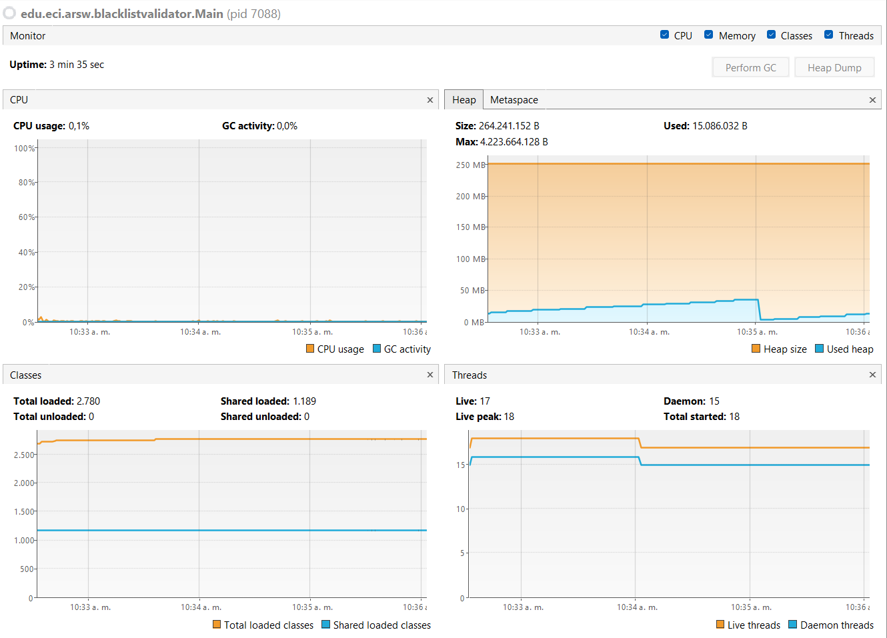
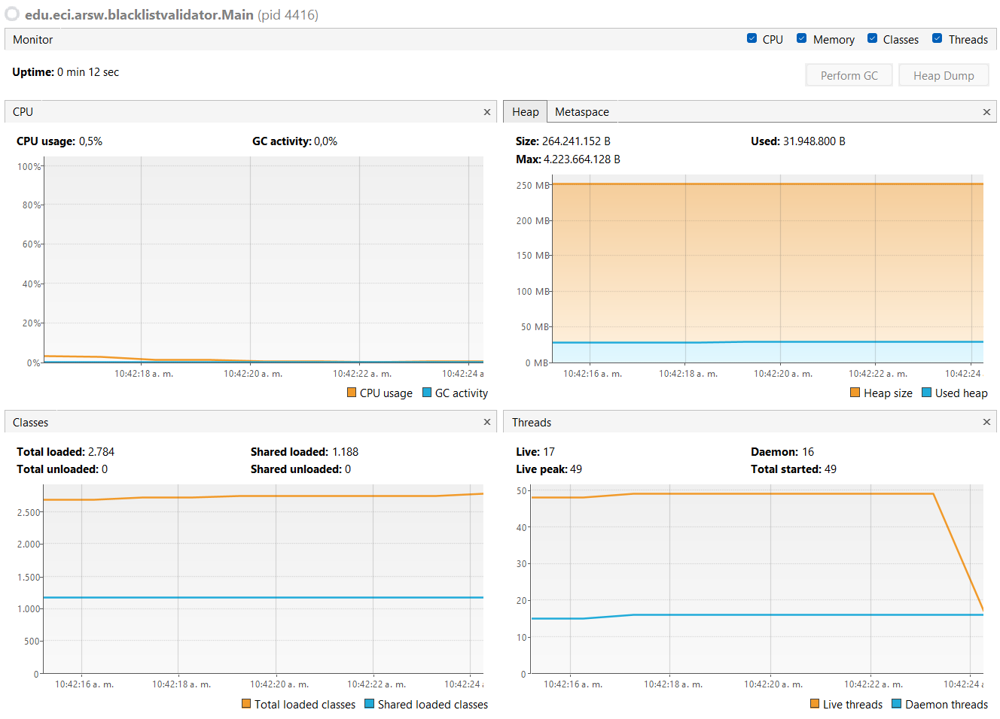

# ARSW Lab 01 2026-I

## Autor: Juan Felipe Ochoa

ESTE REPOSITORIO FUE ALTERADO DEBIDO AL REQUERIMIENTO DE LA PARTE 2 DEL LABORATORIO 3.

## Parte I: Introducción a Hilos en Java
Para esta parte se definen 2 clases: CountThread y CountThreadMain. En la primera se definirá el ciclo de vida del hilo
que contara números entre determinados números A y B, por otro lado, la segunda clase será donde se definen los rangos 
y se ejecutarán los hilos. 

Al iniciar los hilos con start(), se crean los hilos y se ejecutarán al mismo tiempo dando así en la salida por consola
todos los números en desorden, solo determinado por cuál hilo estaba en memoria en ese espacio de tiempo. En cambio, si
la ejecución se hace con el método run(), este NO creará hilos, simplemente ejecutará el método de la clase, haciendo
que la salida por consola sea secuencial al llamado de estos.

## Parte II: Ejercicio Black List Search
En este ejercicio se pide una refactorización, agregando una constante como parámetro para dividir el problema en N hilos. 
Para ello se creó una clase llamada BlackListThread que define la búsqueda segmentada en las listas negras y en el
validator se crea todo el flujo para saber si está en la lista negra o no.

## Parte II.I: Estrategia paralelismo
Una estrategia para optimizar el proceso podría ser la adición de una variable que se actualiza en tiempo real que compartan
todos los hilos y que, cuando lleguen al límite, paren al mismo tiempo. El problema sería que esa variable entraría a ser una
zona crítica y debería ser mutex para que esta solución no tuviera ninguna consecuencia aparente. 

## Parte III - Evaluación de Desempeño
Para la parte de rendimiento se tomaron mediciones para distintas cantidades de hilos. Los siguientes fueron los resultados:

Para un hilo, el proceso se demoró 3 minutos 35 segundos

Para la cantidad de procesadores, es decir, 16 hilos se demoró 30 segundos

Para la cantidad del doble de procesadores, es decir, 32 se demoró 12 segundos

Para 50 hilos se demoró 2 segundos

Y para 100 hilos se demora menos de un segundo.

## Parte IV - Ejercicio Black List Search
Para la fórmula, aunque la lógica diría que entre más hilos allá, más eficiente es, no es realmente cierto, ya que, si bien ayuda,
no lo es todo, pueden llegar sobrecargas, costos de sincronización, latencia, etc. Al final, lo que hay que pensar
realmente es lo más óptimo para el problema a solucionar.